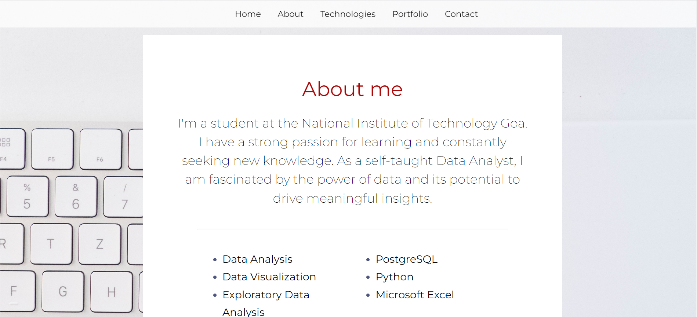
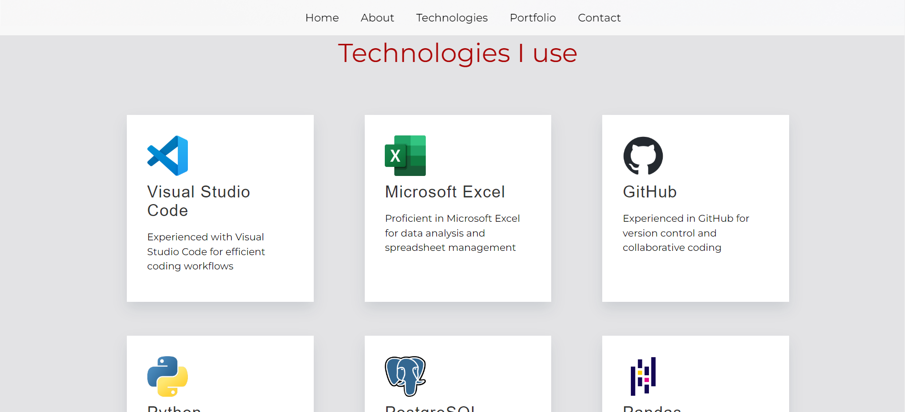
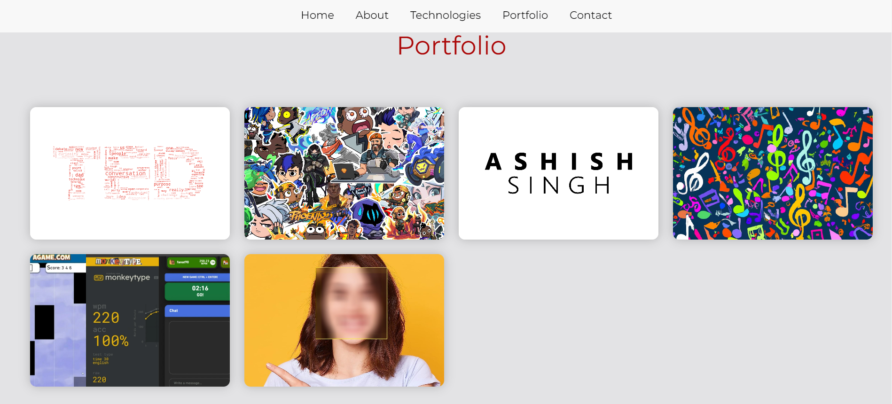
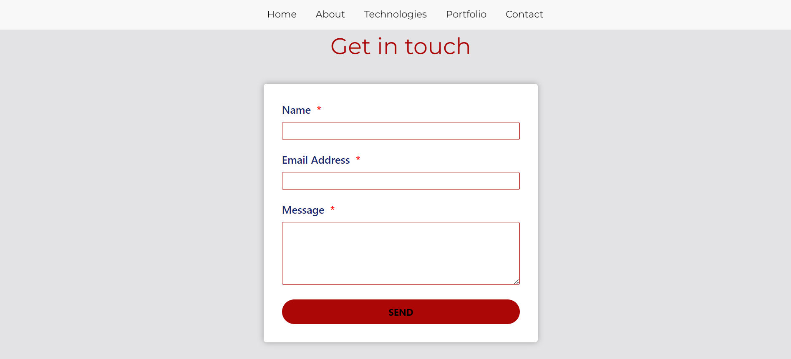

# Ashish Singh - 21CSE1003

## Tech Stack

This project uses the following technologies:

- HTML
- CSS
- JavaScript
- React

## Challenges Faced

During the development of this project, the following challenges were encountered:

- Choosing the right theme and design
- Curating portfolio content
- Implementing animations
- Optimizing mobile responsiveness
- Developing hamburger menu

## Installation

To run this project locally, follow these steps:

1. Clone the repository to your local machine.
2. Install the dependencies using `npm install`.
3. Start the development server using `npm start`.

## Preview

Here's a preview of what the website looks like:

